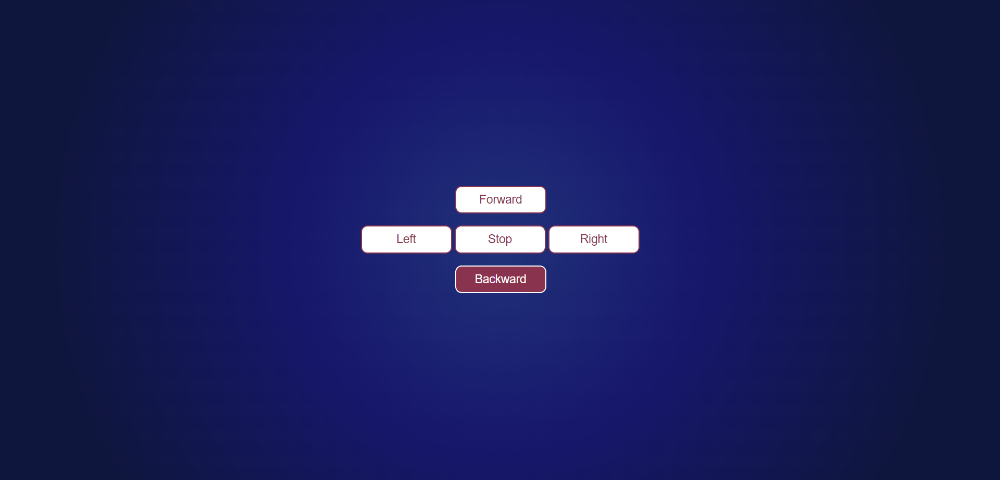
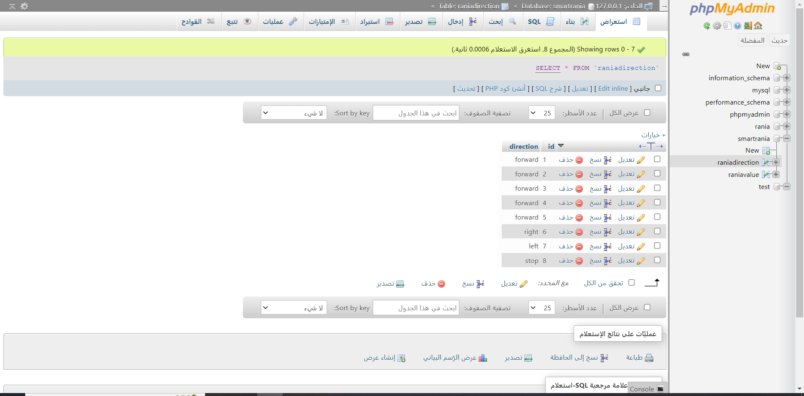
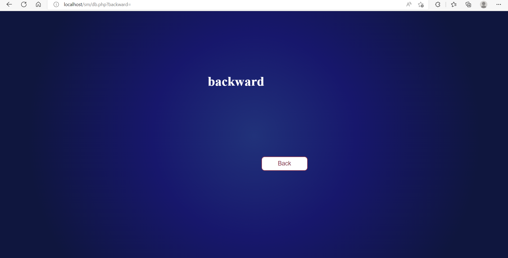
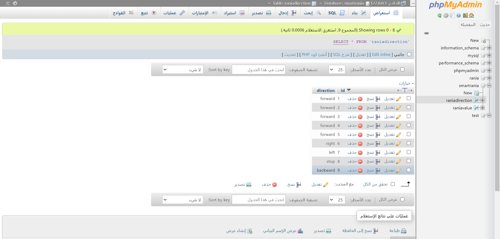

# Control-Panel

Task 4 with Smart Methods:
A web application that takes direction from the user and send it to a database.

## 🛠 Tools

- HTML
- CSS
- JavaScript
- PHP
- MYSQL

## ⭐ Screenshots
- First step: The database before adding the new value

- Second step: Enter an integer in the form

- Third step: After submiting the form

- Forth step:  The database after adding the new value

